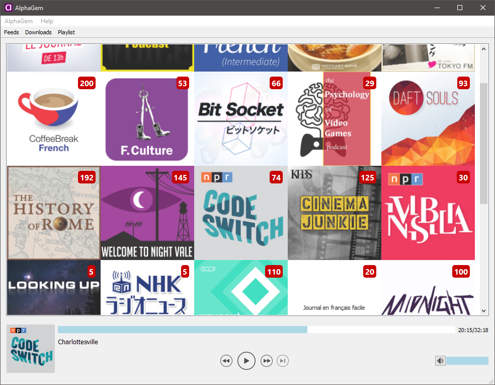
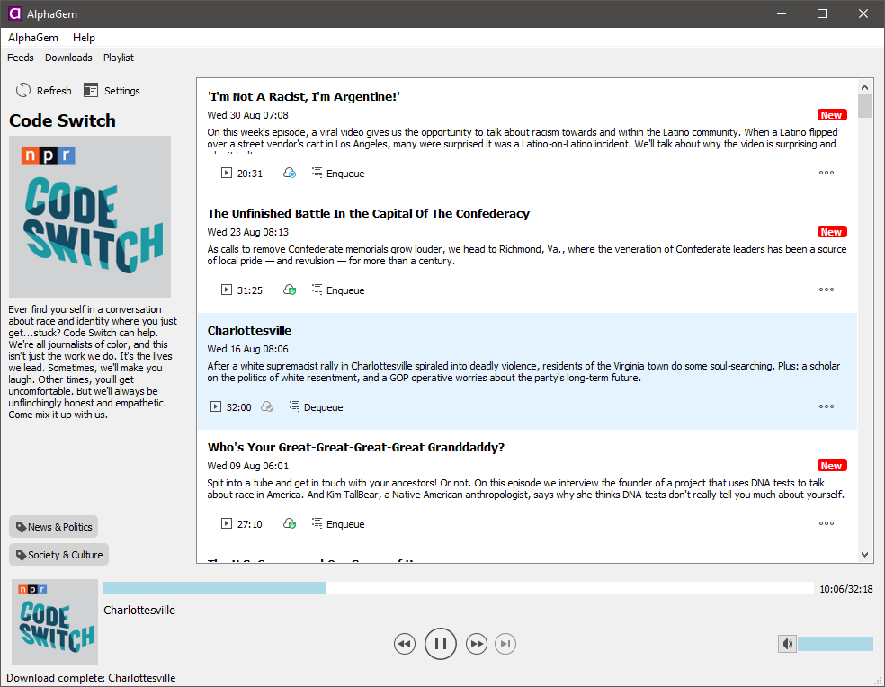
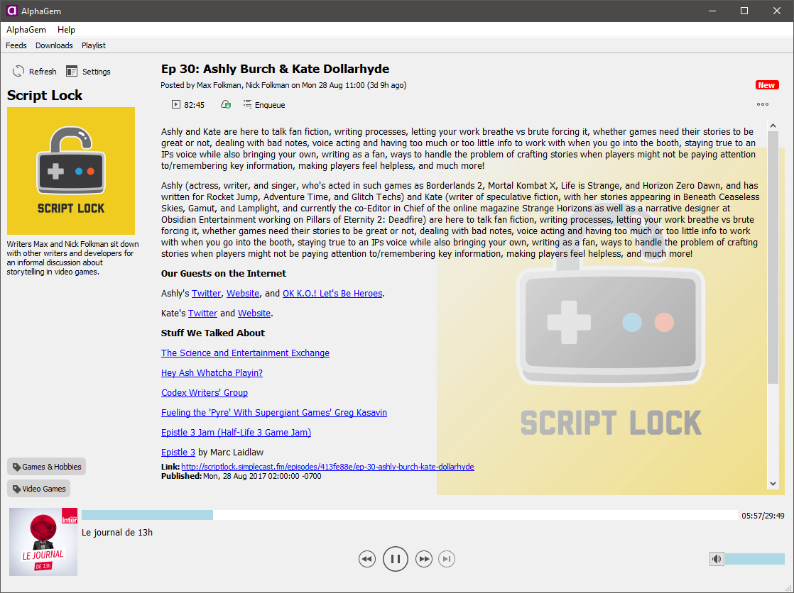
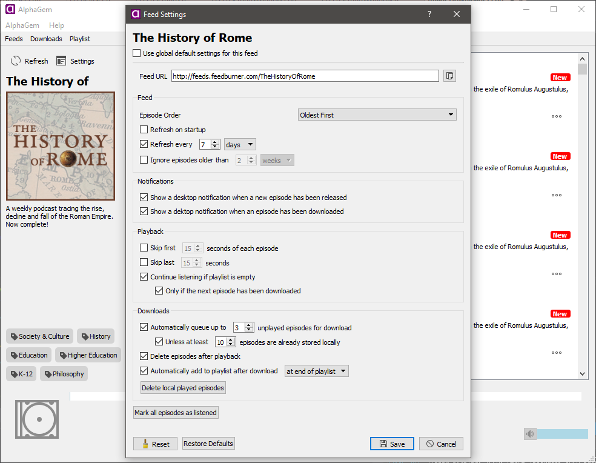

AlphaGem
========

AlphaGem is a podcatcher designed to make it easy to manage your podcast subscriptions in a desktop environment.

Many existing "desktop" podcatchers are actually web-based, meaning they don't allow proper downloading and media management, and desktop media players almost always take a utilitarian approach to podcasts, supporting them only incidentally or as an afterthought, whereas AlphaGem is designed exclusively to be a podcatcher with a user experience and featureset to reflect that.

</img></img>
</img></img>

Downloads
---------
You can download the Windows installer for the latest version [here](releases/installer-v0.1.exe).

Building
--------
Requires:
* Visual Studio 2015
* [Qt 5.9.1](http://qt.io/download-open-source)

If your installation of VS2015 is set up correctly with Qt VS Tools then it will build out of the box.

Building on Linux is technically possible as all code is platform-independent, but right now no Linux-friendly project files are provided.

Licenses
--------
This software is provided under the zlib license. The full text of the zlib license can be found in [LICENSE.md]

A full list of acknowledgements can be found in [ACKNOWLEDGEMENTS.md]